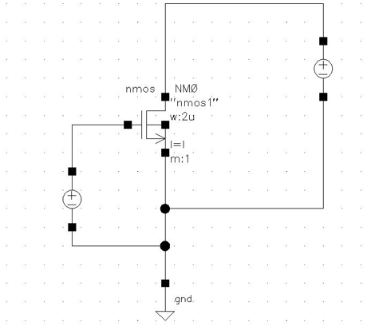
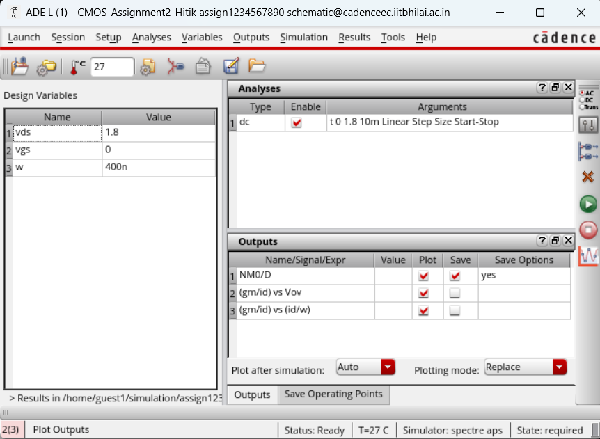
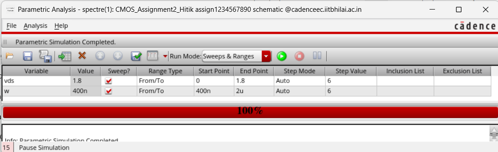
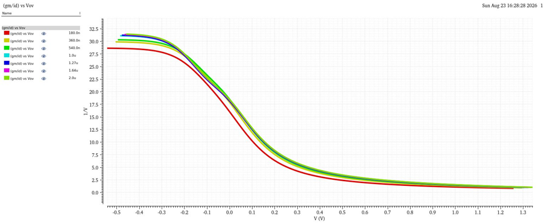
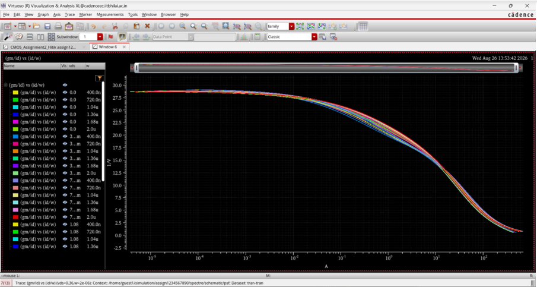

# GM/ID Lookup Table Using Cadence Virtuoso – 180 nm CMOS

## 📌 Project Overview

This project presents the development of a **($g_m/I_D$)-based lookup table** for MOS transistor characterization and sizing using **Cadence Virtuoso** with **180 nm CMOS technology**.

The $g_m/I_D$ methodology provides a systematic approach for selecting the transistor operating point and estimating the required transistor dimensions for analog CMOS circuit design.

The lookup table is generated by performing DC and parametric simulations of a MOS transistor test circuit in Cadence Virtuoso.

---

## 🎯 Aim

To develop a **$g_m/I_D$ lookup table using 180 nm CMOS technology** for calculating the required transistor parameters and dimensions.

---

## 🛠️ Tools and Technology

| Parameter            | Specification                  |
| -------------------- | ------------------------------ |
| EDA Tool             | Cadence Virtuoso               |
| Simulation Tool      | Cadence ADE L                  |
| CMOS Technology      | 180 nm                         |
| Channel Length (L) | 180 nm                         |
| $V_{DS}$ Sweep     | 0 V – 1.8 V                    |
| Width W Sweep    | 400 nm – 2 µm                  |
| DC Sweep Step        | 10 mV                          |
| Main Analysis        | DC Analysis + Parametric Sweep |

---

# 1. Objective

The objective of this experiment is to generate and analyze $g_m/I_D$ lookup curves for a MOS transistor using **180 nm CMOS technology**.

The following relationships are investigated:

$$
\boxed{\frac{g_m}{I_D}\ \text{vs.}\ V_{OV}}
$$

and

$$
\boxed{\frac{g_m}{I_D}\ \text{vs.}\ \frac{I_D}{W}}
$$

These lookup curves can be used to:

* Select a suitable transistor operating point.
* Analyze MOS transistor operation.
* Determine the required transistor width.
* Support analog CMOS circuit design.

---

# 2. Theory

## 2.1 MOSFET Transconductance

The transconductance $g_m$ indicates how effectively the gate voltage controls the drain current $I_D$.

It is defined as

$$
\boxed{g_m=\frac{\partial I_D}{\partial V_{GS}}}
$$

where:

* $g_m$ = Transconductance
* $I_D$ = Drain current
* $V_{GS}$ = Gate-to-source voltage

The unit of $g_m$ is Siemens (S).

---

## 2.2 Overdrive Voltage

The overdrive voltage is defined as

$$
\boxed{V_{OV}=V_{GS}-V_{TH}}
$$

where:

* $V_{OV}$ = Overdrive voltage
* $V_{GS}$ = Gate-to-source voltage
* $V_{TH}$ = Threshold voltage

The overdrive voltage represents the amount by which the gate-to-source voltage exceeds the threshold voltage.

---

## 2.3 $g_m/I_D$ Ratio

The $g_m/I_D$ ratio is defined as

$$
\boxed{\frac{g_m}{I_D}}
$$

It is an important parameter in analog CMOS design because it relates the transistor's transconductance to its bias current.

For the ideal long-channel saturation model,

$$
I_D=\frac{1}{2}\mu_n C_{ox}\frac{W}{L}V_{OV}^{2}
$$

and

$$
g_m=\mu_n C_{ox}\frac{W}{L}V_{OV}
$$

Therefore,

$$
\boxed{g_m=\frac{2I_D}{V_{OV}}}
$$

and

$$
\boxed{\frac{g_m}{I_D}=\frac{2}{V_{OV}}}
$$

The $g_m/I_D$ value generally decreases as the overdrive voltage increases.

---

## 2.4 Normalized Drain Current

The drain current normalized with respect to transistor width is given by

$$
\boxed{\frac{I_D}{W}}
$$

where:

* $I_D$ = Drain current
* W = Transistor width

The normalized current is useful for transistor sizing.

Once $I_D/W$ is obtained from the lookup curve, the required transistor width can be calculated using

$$
\boxed{W=\frac{I_D}{I_D/W}}
$$

---

# 3. Simulation Requirements

The simulation was performed using a MOS transistor with the following conditions:

| Parameter               |         Value |
| ----------------------- | ------------: |
| CMOS Technology         |        180 nm |
| Channel Length (L)    |        180 nm |
| $V_{DS}$              |   0 V – 1.8 V |
| Width (W)             | 400 nm – 2 µm |
| $V_{GS}$              |   0 V – 1.8 V |
| DC Sweep Step           |         10 mV |
| $V_{DS}$ Sweep Points |             6 |
| W Sweep Points      |             6 |

The channel length was fixed at **180 nm**, while $V_{DS}$ and transistor width W were varied using parametric sweeps.

---

# 4. Experimental Setup

The experiment was performed using **Cadence Virtuoso** with **180 nm CMOS technology**.

A MOS transistor test circuit was designed to generate the required data for constructing the $g_m/I_D$ lookup table.

The test circuit was simulated using **Cadence ADE L**.

### MOS Transistor Test Circuit



**Figure 1:** MOS transistor test circuit used for generating the $g_m/I_D$ lookup table.

The test circuit provides the required electrical parameters such as:

* $V_{GS}$
* $V_{DS}$
* $I_D$
* $g_m$

These parameters are then used to calculate the required lookup-table quantities.

---

# 5. Cadence ADE L Setup

The simulation was configured in **Cadence ADE L** using 180 nm CMOS technology.

The DC analysis was performed by sweeping the gate-to-source voltage:

$$
V_{GS}=0\text{ V}\rightarrow1.8\text{ V}
$$

with a step size of

$$
\boxed{\Delta V_{GS}=10\text{ mV}}
$$

The parametric analysis was performed by varying:

$$
V_{DS}=0\text{ V}\rightarrow1.8\text{ V}
$$

and

$$
W=400\text{ nm}\rightarrow2\ \mu\text{m}
$$

with six sweep points for each parameter.



**Figure 2:** ADE L setup showing the design variables, DC analysis, and output expressions.

---

# 6. Parametric Sweep

The parametric sweep was used to investigate the effect of $V_{DS}$ and transistor width W on the MOS transistor characteristics.

The two main swept parameters were:

### Drain-to-Source Voltage

$$
\boxed{V_{DS}=0\text{ V to }1.8\text{ V}}
$$

### Transistor Width

$$
\boxed{W=400\text{ nm to }2\ \mu\text{m}}
$$



**Figure 3:** Parametric sweep setup for $V_{DS}$ and transistor width W.

---

# 7. Results and Discussion

## 7.1 $g_m/I_D$ vs. $V_{OV}$

The first lookup curve represents the variation of $g_m/I_D$ with overdrive voltage $V_{OV}$.

$$
\boxed{\frac{g_m}{I_D}\ \text{vs.}\ V_{OV}}
$$



**Figure 4:** Variation of $g_m/I_D$ with overdrive voltage $V_{OV}$.

From the obtained curve, it can be observed that:

* $g_m/I_D$ decreases as $V_{OV}$ increases.
* Higher $g_m/I_D$ corresponds to lower overdrive voltage.
* The curve represents the transition from weak inversion toward strong inversion.

This curve can therefore be used to select an appropriate $g_m/I_D$ operating point for analog circuit design.

---

## 7.2 $g_m/I_D$ vs. $I_D/W$

The second lookup curve represents the relationship between $g_m/I_D$ and normalized drain current.

$$
\boxed{\frac{g_m}{I_D}\ \text{vs.}\ \frac{I_D}{W}}
$$



**Figure 5:** $g_m/I_D$ plotted against normalized drain current $I_D/W$.

The curve can be used to:

1. Select a desired $g_m/I_D$ value.
2. Obtain the corresponding normalized current $I_D/W$.
3. Calculate the required transistor width.

The transistor width can be calculated using

$$
\boxed{W=\frac{I_D}{I_D/W}}
$$

Thus, the lookup table provides a practical method for transistor sizing in analog CMOS circuits.

---

# 8. Lookup Table

The generated simulation data can be organized into a lookup table containing parameters such as:

| Parameter   | Description                 |
| ----------- | --------------------------- |
| $V_{GS}$  | Gate-to-source voltage      |
| $V_{DS}$  | Drain-to-source voltage     |
| $I_D$     | Drain current               |
| $g_m$     | Transconductance            |
| $V_{TH}$  | Threshold voltage           |
| $V_{OV}$  | Overdrive voltage           |
| $g_m/I_D$ | Transconductance efficiency |
| $I_D/W$   | Normalized drain current    |
| W         | Transistor width            |
| L         | Channel length              |

The lookup table is used to select the transistor operating point and determine the required transistor dimensions.

---

# 9. Bias Point Selection

A target value of $g_m/I_D = 15~\mathrm{V^{-1}}$ was selected from the generated lookup table.

The corresponding transistor operating point obtained from the simulation is shown below.

| Parameter | Selected Value |
|---|---:|
| Target $g_m/I_D$ | $15~\mathrm{V^{-1}}$ |
| Actual $g_m/I_D$ | $15.17~\mathrm{V^{-1}}$ |
| Transistor Width $W$ | $0.4~\mu\mathrm{m}$ |
| Channel Length $L$ | $0.18~\mu\mathrm{m}$ |
| $W/L$ | $2.22$ |
| Gate-to-Source Voltage $V_{GS}$ | $0.46~\mathrm{V}$ |
| Drain-to-Source Voltage $V_{DS}$ | $1.8~\mathrm{V}$ |
| Drain Current $I_D$ | $3.46~\mu\mathrm{A}$ |
| Transconductance $g_m$ | $52.4~\mu\mathrm{S}$ |
| Threshold Voltage $V_{TH}$ | $0.482~\mathrm{V}$ |
| Overdrive Voltage $V_{OV}$ | $-22~\mathrm{mV}$ |
| Normalized Current $I_D/W$ | $8.649~\mu\mathrm{A}/\mu\mathrm{m}$ |

## Verification

The obtained $g_m/I_D$ value is verified using

$$g_m/I_D=\frac{52.4~\mu\mathrm{S}}{3.46~\mu\mathrm{A}}
\approx 15.17~\mathrm{V^{-1}}
$$

which is close to the target value:

$$
\boxed{\frac{g_m}{I_D}=15~\mathrm{V^{-1}}}
$$

### Overdrive Voltage

The overdrive voltage is calculated as

$$
V_{OV}=V_{GS}-V_{TH}
$$

Substituting the simulated values:

$$
V_{OV}=0.46-0.482
$$

Therefore,

$$
\boxed{V_{OV}=-0.022~\mathrm{V}=-22~\mathrm{mV}}
$$

### Selected Bias Point

The selected bias point is:

$$
\boxed{
V_{GS}=0.46~\mathrm{V},\qquad
V_{DS}=1.8~\mathrm{V},\qquad
I_D=3.46~\mu\mathrm{A}
}
$$

with transistor dimensions:

$$
\boxed{
W=0.4~\mu\mathrm{m},\qquad
L=0.18~\mu\mathrm{m}
}
$$

and transconductance:

$$
\boxed{g_m=52.4~\mu\mathrm{S}}
$$

The resulting value of

$$
\boxed{\frac{g_m}{I_D}=15.17~\mathrm{V^{-1}}}
$$

closely matches the target value of $15~\mathrm{V^{-1}}$.
---

# 10. Key Observations

The major observations from the simulation are:

* The $g_m/I_D$ ratio decreases with increasing $V_{OV}$.
* The $g_m/I_D$ lookup curve can be used to identify a suitable operating point.
* The $I_D/W$ parameter provides information useful for transistor sizing.
* Parametric sweeps of $V_{DS}$ and W allow the transistor characteristics to be studied under different operating conditions.
* The generated lookup curves provide a systematic approach to MOS transistor sizing.

---

# 11. Applications

The $g_m/I_D$ lookup-table methodology can be applied to:

* Analog CMOS circuit design
* MOS transistor sizing
* Bias-point selection
* Low-power analog design
* Operational amplifier design
* OTA design
* Current mirror design
* Analog front-end design

---

# 12. Repository Structure

```text
gm-id-lookup-table-cadence-180nm/
│
├── README.md
│
├── schematic/
│   └── mos_test_circuit.png
│
├── simulation/
│   ├── ade_setup.png
│   └── parametric_sweep.png
│
├── results/
│   ├── gm_id_vs_vov.png
│   └── gm_id_vs_id_w.png
│
├── data/
│   └── lookup_table.xlsx
│
└── report/
    └── GM_ID_Lookup_Table_180nm_CMOS_Cadence_Virtuoso.pdf
│
└──biasing_point/
    └── biasing_point.png

```

---

# 13. Software and Tools

* **Cadence Virtuoso**
* **Cadence ADE L**
* **180 nm CMOS PDK**
* **Excel / Spreadsheet** for lookup-table organization

---

# 14. Result

The $g_m/I_D$ lookup curves were successfully generated using **Cadence Virtuoso with 180 nm CMOS technology**.

The channel length was fixed at 180 nm, while $V_{OV}$ and transistor width W were varied using parametric sweeps. The resulting plots of

$$
\frac{g_m}{I_D}\ \text{vs.}\ V_{OV}
$$

and

$$
\frac{g_m}{I_D}\ \text{vs.}\ \frac{I_D}{W}
$$

were obtained using a DC sweep step of 10 mV.

---

# 15. Conclusion

A $g_m/I_D$-based lookup table was successfully developed using **Cadence Virtuoso and 180 nm CMOS technology**.

The simulation results demonstrate that the lookup curves can be used to select a suitable MOS transistor bias point and determine the required transistor width.

Therefore, the $g_m/I_D$ methodology provides a useful and systematic approach for **MOS transistor characterization, operating-point selection, and transistor sizing in analog CMOS circuit design**.

---

# 👨‍💻 Author

**Hitik Kumar Nayak**

M.Tech – Microelectronics and VLSI
Indian Institute of Technology Bhilai

### Technical Skills Demonstrated

`Cadence Virtuoso` · `Cadence ADE L` · `CMOS 180nm` · `Analog IC Design` · `MOSFET Characterization` · `g_m/I_D Methodology` · `Transistor Sizing`

---

## 📚 Project Information

**Project Type:** Academic VLSI Design Assignment

**Domain:** Analog CMOS / VLSI

**Technology:** 180 nm CMOS

**Primary Methodology:** $g_m/I_D$ Lookup-Table Method
